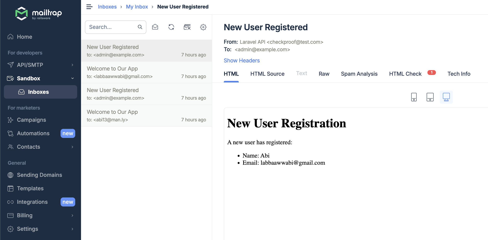
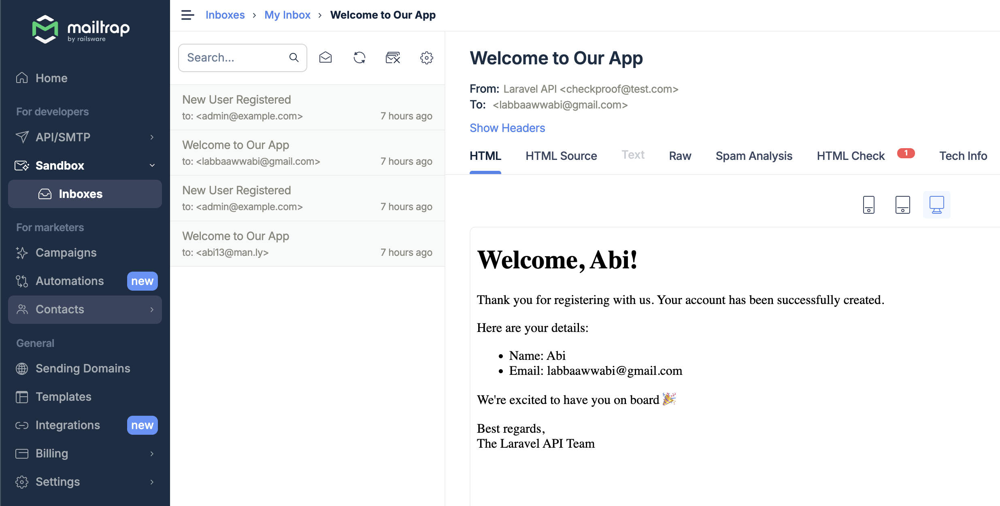

# Simple API for User Management

This project is a simple API for registering new users and retrieving user information. It was developed as a technical test for the Senior Fullstack PHP Engineer position at CheckProof.

## Technologies

- **Framework:** Laravel 12
- **Architecture:** Hexagonal Architecture with Domain-Driven Design (DDD)
- **Pattern:** CQRS (Command Query Responsibility Segregation)
- **Testing:** Both unit and feature tests for automation

## Project Structure

The project is organized following the principles of Hexagonal Architecture, aiming to separate core business logic from infrastructure concerns. This structure supports scalability and maintenance.

## Getting Started

1. **Clone the Repository**
    ```bash
    git clone git@github.com:awwabi/laravel-12-api.git
    cd laravel-simple-api
    ```

2. **Environment Setup**
    Copy the `.env.example` file to create your own `.env` configuration:
    ```bash
    cp .env.example .env
    ```
    Modify the necessary `.env` variables.

3. **Docker Compose**
    ```bash
    docker compose up -d
    ```

4. **Run Tests**
    Execute the test suite inside container to ensure everything is working:
    ```bash
    php artisan test
    ```

## How to Get API Token
Since we are not providing endpoint for login, we can get api token by execute this command:
```bash
php artisan login:user {role}
```
Available role: `user`, `manager`, `admin`

## API Endpoints

- **Register New User**: POST `/api/users`
```bash
curl --location 'localhost:8000/api/users' \
--header 'Authorization: Bearer {token}'
```
- **Retrieve User Info**: GET `/api/users`
```bash
curl --location 'localhost:8000/api/users' \
--header 'Authorization: Bearer {token}'
```

## Conclusion

This API is built to be robust, maintainable, and scalable, utilizing modern PHP practices and architectural patterns. 

## Email Test Result
- Email sent to admin:

- Email sent to new user:


- **Note on Test Coverage:**  
  Please be aware that while key functionalities are covered by tests, the suite does not account for every edge case. Full test coverage was not feasible due to the extensive effort required to cover all scenarios.